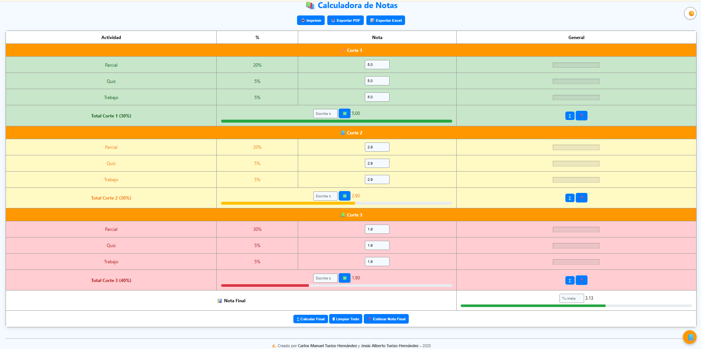

# 📚 Calculadora de Notas 🎓

Bienvenido a la **Calculadora de Notas Universitaria**, una herramienta educativa desarrollada con ❤️ por **Carlos Manuel Turizo Hernández** y **Jesús Alberto Turizo Hernández**. Diseñada especialmente para estudiantes que desean llevar un control visual, interactivo y profesional de sus notas.  

---

## 🧠 ¿Qué puedes hacer con esta calculadora?

- ✏️ **Calcular automáticamente** tus cortes con porcentajes personalizados.
- 🎯 **Estimar cuánto necesitas sacar** en una actividad o corte para alcanzar tu meta.
- 📊 **Obtener tu nota final total** con base en los 3 cortes.
- 📥 **Exportar tus resultados**:
  - En formato **PDF** 📄
  - En formato **Excel** 📊
  - O simplemente **Imprimir** 🖨️
- 🌙 Cambiar entre **modo claro y oscuro** para tu comodidad visual.

---

## 🔍 Vista Previa



---

## 🚀 ¿Cómo funciona?

### 1. **Cálculo por cortes**
Cada corte está compuesto por:
- **Parcial**  
- **Quiz**  
- **Trabajo**

Solo debes ingresar tus notas en las casillas correspondientes y hacer clic en el botón **∑** para obtener el total del corte (calculado automáticamente con su respectivo porcentaje).

---

### 2. **Ingresar nota manualmente**
También puedes ingresar directamente el total del corte si ya conoces tu nota final (por ejemplo, si ya te la dio el profesor). Escribe la nota y presiona **✅**.

---

### 3. **Estimar cuánto necesitas sacar**
¿Te falta hacer un parcial o trabajo y quieres saber cuánto necesitas para alcanzar una meta?

- Deja en blanco la casilla de la actividad pendiente.
- Haz clic en **❓** y escribe la nota deseada (ej. 3.5).
- La calculadora te dirá cuánto necesitas sacar.

También puedes hacer clic en **❓ Estimar Nota Final** si ya tienes dos cortes completos y quieres saber cuánto necesitas en el corte que falta.

---

### 4. **Nota final**
Haz clic en **∑ Calcular Final** para ver tu promedio total basado en los 3 cortes:

- Corte 1: 30%  
- Corte 2: 30%  
- Corte 3: 40%  

Se mostrará tu nota final con una **barra de progreso y colores según rendimiento**.

---

## 🎨 Características visuales

- ✅ Modo claro/oscuro 🌙☀️  
- ✅ Colores dinámicos:  
  - Verde ✅ si tu nota es mayor a 3.0  
  - Amarillo ⚠️ entre 2.0 y 3.0  
  - Rojo ❌ menor a 2.0  
- ✅ Barras de progreso para cada corte y nota final  
- ✅ Sonido al hacer clic 🔊  
- ✅ Animaciones suaves y diseño educativo  

---

## 📦 Tecnologías Usadas

- HTML5  
- CSS3  
- JavaScript  
- 📄 [jsPDF](https://github.com/parallax/jsPDF) + [AutoTable](https://github.com/simonbengtsson/jsPDF-AutoTable) (para exportar PDF)
- 📊 [SheetJS](https://sheetjs.com/) (para exportar Excel)

---

## 🖥️ ¿Cómo usarlo?

### 🔗 En línea
Puedes usarla directamente desde GitHub Pages:

👉 [https://manu270422.github.io/calculadora-notas/](https://manu270422.github.io/calculadora-notas/)

### 💻 Localmente
1. Clona el repositorio:
```bash
git clone https://github.com/Manu270422/calculadora-notas.git
```
2. Abre el archivo `index.html` con tu navegador (o desde Live Server en VSCode)

---

## ✍️ Créditos

Desarrollado por:

**Carlos Manuel Turizo Hernández**  
**Jesús Alberto Turizo Hernández**

---

## 📄 Licencia

Este proyecto es de uso educativo y personal. Distribución libre con reconocimiento de los autores.