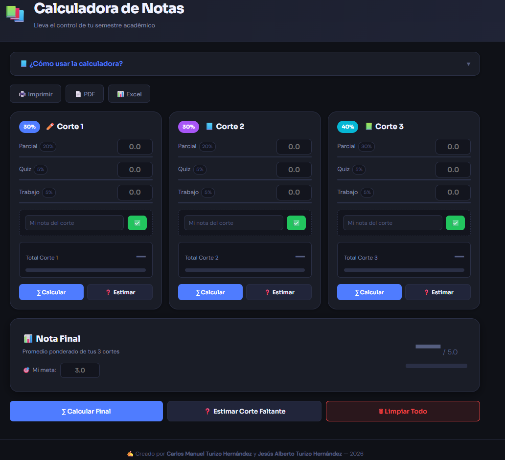

<div align="center">

# Calculadora de Notas Universitaria

**Herramienta web para gestión y estimación académica de calificaciones**

[](https://manu270422.github.io/calculadora-notas/)
[](https://developer.mozilla.org/es/docs/Web/HTML)
[](https://developer.mozilla.org/es/docs/Web/CSS)
[](https://developer.mozilla.org/es/docs/Web/JavaScript)
[](#licencia)



</div>

---

## Descripción

Aplicación web estática que permite a estudiantes universitarios calcular, estimar y exportar sus calificaciones por corte académico. Soporta el esquema de ponderación estándar de 3 cortes (30% / 30% / 40%), con visualización dinámica del rendimiento y exportación a PDF y Excel — sin dependencias de servidor ni instalación requerida.

---

## Características

| Funcionalidad | Detalle |
|---|---|
| Cálculo automático por corte | Parcial + Quiz + Trabajo ponderados por porcentaje configurable |
| Entrada manual de nota | Permite ingresar el total del corte directamente |
| Estimación inversa | Calcula la nota necesaria en una actividad o corte para alcanzar una meta |
| Nota final ponderada | Suma ponderada: Corte 1 (30%) + Corte 2 (30%) + Corte 3 (40%) |
| Exportación a PDF | Generado con jsPDF + AutoTable en el cliente |
| Exportación a Excel | Generado con SheetJS directamente en el navegador |
| Impresión | Vista de impresión optimizada |
| Tema claro / oscuro | Persistente durante la sesión |
| Indicadores visuales | Barras de progreso y colores según desempeño (≥3.0 / 2.0–3.0 / <2.0) |

---

## Stack tecnológico

- **HTML5 / CSS3 / JavaScript** — sin frameworks, sin bundler, cero configuración
- **[jsPDF](https://github.com/parallax/jsPDF)** + **[jsPDF-AutoTable](https://github.com/simonbengtsson/jsPDF-AutoTable)** — exportación de reportes en PDF
- **[SheetJS (xlsx)](https://sheetjs.com/)** — exportación de hojas de cálculo en Excel
- **GitHub Pages** — despliegue estático

---

## Uso

### En línea (recomendado)

Accede directamente desde el navegador, sin instalación:

```
https://manu270422.github.io/calculadora-notas/
```

### Local

```bash
git clone https://github.com/Manu270422/calculadora-notas.git
cd calculadora-notas
```

Abre `index.html` en tu navegador o usa [Live Server](https://marketplace.visualstudio.com/items?itemName=ritwickdey.LiveServer) en VS Code.

> No requiere Node.js, npm ni ningún paso de compilación.

---

## Lógica de cálculo

### Total por corte

```
Total_Corte = (Parcial × w₁) + (Quiz × w₂) + (Trabajo × w₃)
```

Donde `w₁ + w₂ + w₃ = porcentaje del corte`.

### Nota final

```
Nota_Final = (Corte1 × 0.30) + (Corte2 × 0.30) + (Corte3 × 0.40)
```

### Estimación inversa

Dado un objetivo y las actividades ya calificadas, la calculadora despeja la nota necesaria en la actividad o corte faltante.

---

## Indicadores de rendimiento

| Rango | Estado |
|---|---|
| ≥ 3.0 | Aprobado |
| 2.0 – 2.99 | En riesgo |
| < 2.0 | Reprobado |

---

## Estructura del proyecto

```
calculadora-notas/
├── index.html        # Estructura principal.
├── style.css         # Estilos y temas (claro/oscuro).
├── script.js         # Lógica de cálculo y exportación.
├── preview.png       # Captura de pantalla para documentación.
└── README.md
```

---

## Roadmap

- [ ] Persistencia de datos con `localStorage`
- [ ] Soporte para esquemas de ponderación personalizados
- [ ] Historial de semestres
- [ ] PWA (instalable en móvil)
- [ ] Internacionalización (i18n)

---

## Autores

**Carlos Manuel Turizo Hernández** · **Jesús Alberto Turizo Hernández**

Proyecto académico desarrollado con fines educativos.

---

## Licencia

Distribución libre para uso educativo y personal con atribución a los autores originales.